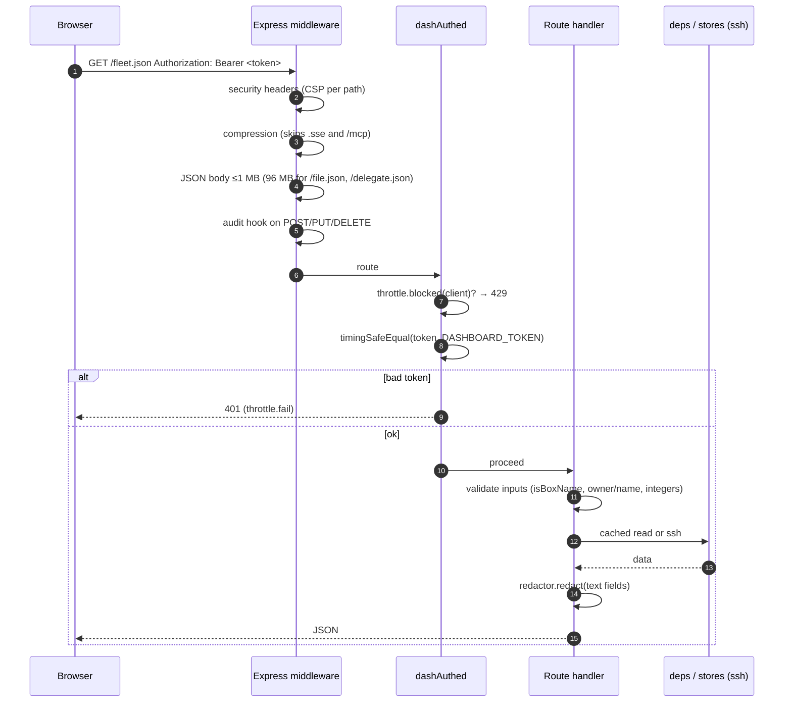
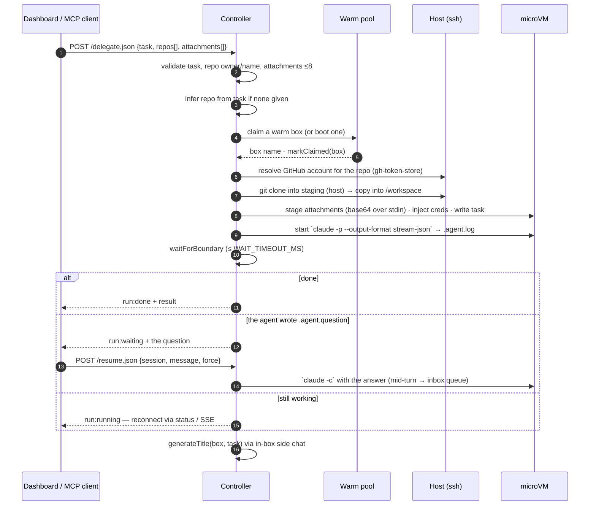
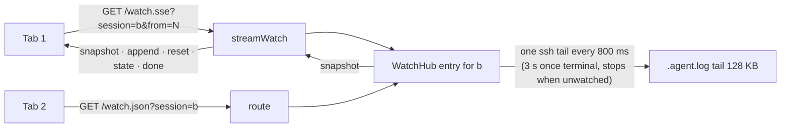
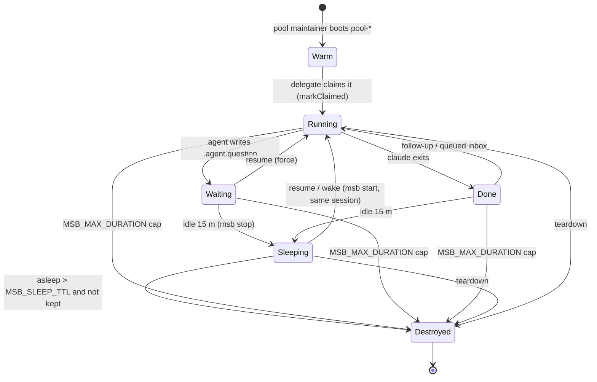
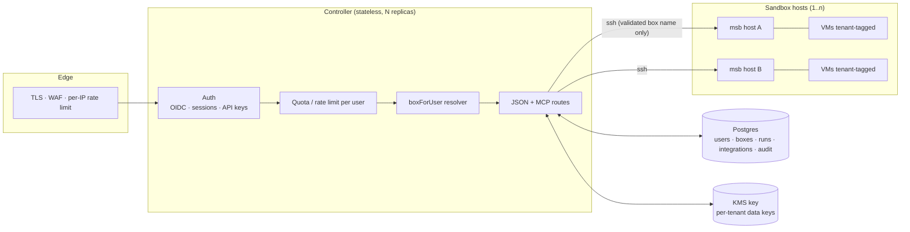

# Architecture — what exists, how a request flows, and what multi-tenant would change

This is the map. `README.md` explains *why*; `docs/security.md` explains the *boundaries*;
`docs/lifecycle.md` explains the *timers*. This document draws the pieces and the flows between them,
then spells out exactly what "identity project" means for this codebase.

## 1. The pieces

```mermaid
flowchart LR
  subgraph Clients
    B[Browser<br/>React dashboard<br/>/dashboard]
    IDE[IDE / MCP client<br/>Cursor, Claude Code…]
    CI[Script / CI]
  end

  subgraph Controller["Controller — Node/Express (Docker on the VPS)"]
    R[JSON routes<br/>/fleet /watch /delegate …]
    M[MCP Streamable HTTP<br/>/mcp]
    H[handlers.ts<br/>shared tool logic]
    D[deps.ts<br/>side effects]
    WH[WatchHub<br/>one tail loop per box]
    FR[FleetReader<br/>1.5 s cache]
    RED[Redactor<br/>known + shaped secrets]
    ST[Stores<br/>mcp-store · gh-token-store · titles · claims]
  end

  subgraph Host["VPS host — over SSH (ControlMaster)"]
    MSB[msb CLI]
    FS["~/.agent-sandbox/*<br/>claims · keep · titles · runs<br/>mcp.json · gh-tokens.json"]
    STG[/root/agent-sandbox-staging/&lt;box&gt;]
  end

  subgraph VM["microVM per run (libkrun/KVM)"]
    CC[Claude Code<br/>claude -p stream-json]
    WS[/workspace<br/>repo · .agent.log · .agent.question]
    PX[ccproxy → model]
  end

  B -- "HTTPS · Bearer DASHBOARD_TOKEN" --> R
  IDE -- "HTTPS · Bearer MCP_HTTP_TOKEN" --> M
  CI -- "HTTPS · Bearer" --> R
  R --> H
  M --> H
  H --> D
  D -- ssh --> MSB
  D -- ssh --> FS
  D -- rsync/ssh --> STG
  MSB --> VM
  R --> WH --> D
  R --> FR --> D
  R --> RED
  D --> ST -- ssh --> FS
  CC --> WS
  CC --> PX
```

Facts that matter:

- **The browser never touches SSH.** Every arrow out of the controller to the host is an `ssh`/`rsync`
  subprocess started by the controller with its own key. Clients only ever see HTTP.
- **Two entries, one brain.** The JSON routes and the MCP tools both call `handlers.ts` → `deps.ts`,
  so a run started from an IDE is the same object the dashboard shows.
- **State lives on the host as files**, read over SSH and cached in the controller's memory
  (fleet 1.5 s, titles/MCP store 60 s, watch hub per box). There is no database.
- **Box names are the only key.** `pool-<ts>-<rand>` / `session-…` identifies a run everywhere: in
  `msb`, in every store file name, in every route's `session` parameter.

## 2. Request flow and authentication (today)



- `DASHBOARD_TOKEN` guards the JSON routes; `MCP_HTTP_TOKEN` guards `/mcp`. If `DASHBOARD_TOKEN` is
  unset it falls back to `MCP_HTTP_TOKEN` (one token, as before). Both are header-only; there is no
  `?token=`. The browser stores its token in `localStorage` (`asb-token`).
- **Every** state-changing call writes one `[audit] {…}` JSON line to stderr: time, client address,
  method, path, status, duration, and the whitelisted `session` / `action` / `repo` fields. Never a
  body, message or token.

## 3. Delegating a task



## 4. Watching a run (SSE)



- `diffLog(prevOffset, latest, prevLog)` sends `append` only when the new text extends the old; a
  sliding tail window (log > 128 KB) produces `reset` instead of garbage.
- The browser keeps the last snapshot per box (`useWatchStream` cache) and reconnects with
  `?from=<offset>`; a 3 s `/watch.json` poll is the fallback and is preferred whenever it is fresher.

## 5. Box lifecycle



- **Keep** (`~/.agent-sandbox/keep/<box>`) removes the `Sleeping → Destroyed (TTL)` edge only.
- The claim marker's mtime is the sleep clock; it is re-stamped when the fleet sweep sees
  Running → Stopped, so "asleep 40m" and the TTL count from the nap.

## 6. On-host state (what a "database" would replace)

| Path on the VPS | Written by | Read by | Contents |
|---|---|---|---|
| `~/.agent-sandbox/claims/<box>` | claim / fleet sweep | fleet, reaper | empty file; mtime = sleep clock |
| `~/.agent-sandbox/keep/<box>` | `/keep.json` | fleet, reaper | empty file = pinned |
| `~/.agent-sandbox/titles/<box>` | title generator, `/rename.json` | fleet | one line |
| `~/.agent-sandbox/runs/*` | delegate / status | fleet (last-known run for a stopped box) | run memory |
| `~/.agent-sandbox/gh-tokens.json` | Integrations | delegate, PR card, repo list | GitHub PATs by login (plaintext, `chmod 600`) |
| `~/.agent-sandbox/mcp.json` | Integrations | bootstrap (copied into every box) | MCP servers incl. env secrets |
| `/root/agent-sandbox-staging/<box>/` | delegate, attach | copy into the box | clones |
| inside the VM: `/workspace/.agent.log`, `.agent.question`, `.agent.status` | the in-box agent | watch hub, fleet | the transcript and the question channel |

## 7. "It's an identity project" — what each item means here

The single-tenant model is not a shortcut; it is what a personal controller should be. But every one
of the items below is a **missing concept**, not a missing check, which is why hardening cannot get
there.

| Today | Why it blocks a multi-user product | What has to exist |
|---|---|---|
| One `DASHBOARD_TOKEN` shared by every browser; one `MCP_HTTP_TOKEN` for every MCP client | No notion of *who*. Revoking one person means rotating for everyone. `localStorage` token never expires. | **Users + sessions.** Login (OIDC or email link) → server-side session → `HttpOnly; Secure; SameSite=Lax` cookie + CSRF token for the JSON routes. `req.user` on every request. |
| `/mcp` shares the same secret class | An IDE integration is a long-lived machine credential; a browser session is not. | **Per-user API keys** for `/mcp`: random, shown once, stored hashed, revocable, scoped (`delegate`, `read`). |
| A box is identified by name alone; routes do `find(b => b.name === session)` | Any authenticated user can `teardown`/`resume`/read any box by guessing or listing names. | **Ownership.** `owner_id` on every box/claim/keep/title/inbox record; a `boxForUser(user, name)` resolver used by *every* route and MCP tool; fleet listing filtered by owner. |
| One `gh-tokens.json`, one `mcp.json`, one staging dir | Tenant A's GitHub PAT and MCP env would be injected into tenant B's box. | **Per-tenant configuration**: stores keyed by tenant, injection only into that tenant's boxes, per-tenant staging root. |
| Files over SSH with in-memory caches | No transactions, no queries by owner, no history; caches per process. | **A database** (Postgres, or SQLite if single-node): `users, sessions, api_keys, boxes, runs, repos, integrations, audit_events`. The SSH hop stays for `msb` and the VM only. |
| Secrets in plaintext files on the host | A host read = every customer's GitHub. | **Encryption at rest** (KMS/age key held by the controller, per-tenant data keys), redaction lists per tenant. |
| `MSB_MAX_BOXES` global; throttle per client address | One customer can exhaust the fleet or the API for everyone. | **Quotas** per plan (boxes, run minutes, uploads) and **rate limits** per user, enforced before `msb`. |
| `[audit]` lines on stderr with a client address | Fine for an operator; not attributable to a person, not queryable, not retained per tenant. | **Audit table** with `user_id`, exportable per tenant. |
| Egress allowlist and CPU/RAM per box are global | Plans differ; noisy neighbours. | Per-tenant egress policy and box sizing. |

### Order of work

1. Database + `users/sessions/api_keys/boxes` tables; import today's file state.
2. Login + cookie session for the dashboard; API keys for `/mcp`; retire `asb-token` in `localStorage`.
3. `owner_id` everywhere + the single `boxForUser` resolver; fleet filtered per user.
4. Per-tenant integrations (GitHub, MCP) and staging; encryption at rest.
5. Quotas, per-user rate limits, audit table; billing hooks.

Until 2 and 3 are done, deploy **one controller + one token per customer** — the model that is live
today and is safe as such.

## 8. Target shape


