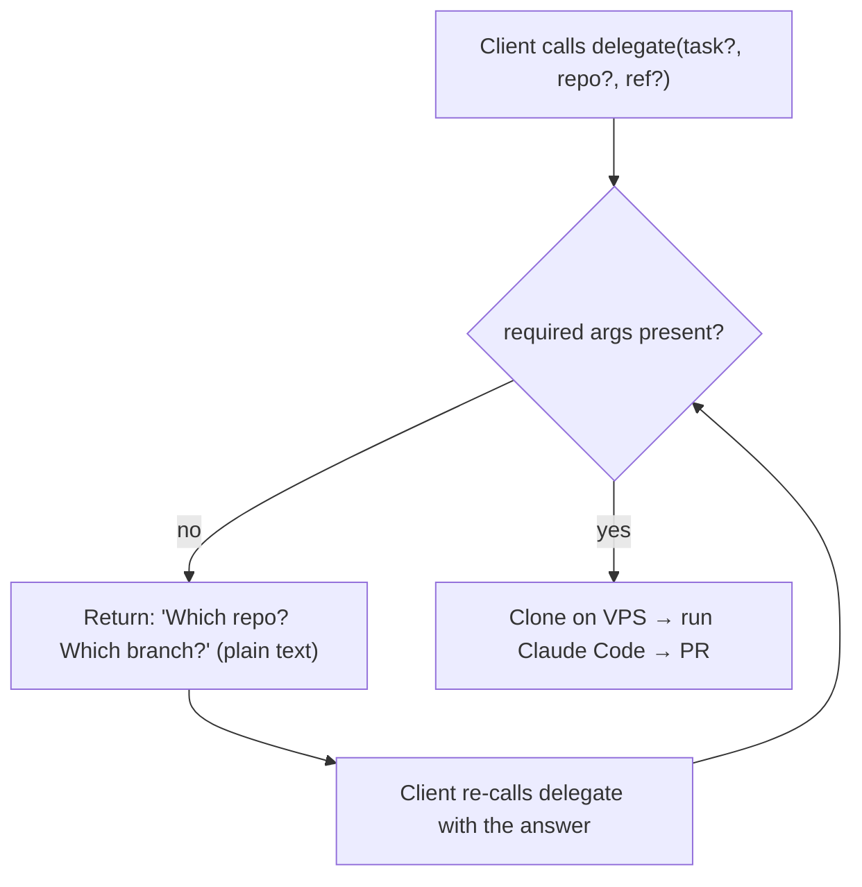

# Remote MCP controller — plan

## Vision
Delegate from **Cursor first** — both the local "delegate THIS" flow (stdio) and a remote
"delegate a git repo" flow (Cursor's remote MCP over HTTP). Because it's MCP, the same HTTP
endpoint also works from **any other MCP client** (Claude web, other IDEs, CI). Two entry points,
one shared muscle on the VPS.

```
Cursor (Mac, stdio) ─ local edits ─┐
Claude web/phone/CI ─ HTTPS+token ─┤→ same msb + warm pool (VPS) → microVMs → Claude Code → PR
```

Guiding rule: **build only what the goal needs now.** Phase 1 ships the feature. Phase 2 is a
backlog we pull from only when a real task demands it — not before.

---

# Phase 1 — lean remote trigger + ask-if-missing (BUILD NOW)

## Scope
1. Reach delegation from other MCP clients over HTTPS.
2. Remote delegations run on a **git repo/branch** (remote can't see the Mac's files).
3. **Ask-if-missing:** if a delegate call lacks a required arg, don't fail — return a question;
   you re-call with the value.

## What that needs
| File | New? | Job |
|---|---|---|
| `src/git-source.ts` | new | fresh shallow clone `owner/repo@ref` on the VPS (uses GH_TOKEN) |
| `src/http.ts` | new | Streamable HTTP transport + bearer-token guard; reuses existing handlers |
| `src/handlers.ts` | refactor | extract the current tool handlers so stdio (`index.ts`) and HTTP share them |
| `src/index.ts` | small edit | import shared handlers; stays the stdio/rsync entry (unchanged behavior) |

Reused untouched: `msb.ts`, `pool.ts`, `config.ts`, `ssh.ts`, `sync.ts`, egress, caps, warm
pool, no-attribution, `resume`, `teardown`, `status`, `pool_status`.

## Ask-if-missing — kept simple (no marker protocol)
This is the ONLY ask feature in Phase 1, and it lives entirely in the delegate tool — **not** in
the agent. No fenced markers, no mid-task pausing (that's Phase 2).



Rules:
- Required for a remote delegate: `repo` (+ `task`). `ref` optional (defaults to repo default branch).
- Missing → return a short, plain-text question listing exactly what's needed. No error, no crash.
- The client (you) re-calls `delegate` with the value. Stateless — no half-open session to track.

## delegate tool (Phase 1 shape)
| Arg | Required? | Note |
|---|---|---|
| `task` | yes | natural-language task |
| `repo` | yes (remote) | `owner/name` or full https URL |
| `ref` | no | branch/tag/SHA; default = repo default branch |
| `allowDomains` | no | extra egress domains |

Missing `repo` or `task` → returns: `Need: repo (owner/name), task. You gave: <what>. Re-call
delegate with the rest.`

## git-source (fresh clone, idempotent)
- Always `git clone --depth 1 --branch <ref>` into a per-session staging dir. Never reuse/pull.
- Private repos: use GH_TOKEN in the HTTPS URL. GitHub-only for now, behind one function so other
  hosts can be added later.
- Output = staging path, handed to the existing `acquireBox`/copy flow exactly like rsync staging.

## Transport + deploy
- `http.ts`: Streamable HTTP at `/mcp`, require `Authorization: Bearer <MCP_HTTP_TOKEN>`. App
  binds `127.0.0.1:8787`; Traefik terminates TLS at `agent-sandbox.<domain>`.
- systemd unit keeps it alive across reboots; `EnvironmentFile=.env`.
- **SSH-to-self is fine for now:** the on-VPS controller can keep using `VPS_SSH=<vps>` (a real
  ssh hop to itself). We do NOT build a local runner in Phase 1 — it's an optimization, deferred.

## Security (Phase 1 = adequate for a private, single-user tool)
- TLS (Traefik) + bearer token (long, random, in `.env`, rotatable).
- Existing blast-radius caps already apply: `MSB_MAX_BOXES`, per-box `-m`, idle/max-duration
  auto-teardown, egress allowlist.
- Never expose `:8787` raw. Token in `.env` only (gitignored).
- Note: the token can boot VMs + reach GH_TOKEN. Fine while it's just you. Hardening → Phase 2.

## Build order (each independently verifiable)
| # | Step | Verify | Status |
|---|---|---|---|
| 0 | test harness (tsx + node:test) | `npm test` runs | ✅ |
| 1 | `handlers.ts` — extract handlers from `index.ts`; stdio unchanged | stdio lists 5 tools | ✅ (4 tests) |
| 2 | `git-source.ts` — fresh shallow clone on VPS | pure helpers tested; clone builds argv | ✅ (8 tests) |
| 3 | delegate: `source`/`repo`/`ref` args + **ask-if-missing** | omit repo → question, not error | ✅ (9 tests) |
| 4 | `http.ts` — Streamable HTTP + bearer token | live: 401 w/o token, tools/list w/ token | ✅ (6 auth tests + live) |
| 5 | Dockerfile + compose (Dokploy) + `agent-sandbox.example.com` + `MCP_HTTP_TOKEN` | files ready; `SSH_EXTRA_OPTS` for container→host | ✅ artifacts (3 ssh tests) |
| 6 | deploy to Dokploy; add URL to Claude web; live smoke `delegate owner/repo@main` | real PR opens | ⏳ needs you (deploy) |

**Test total: 29 passing.** Files: `git-source.ts`, `delegate-input.ts`, `handlers.ts`,
`deps.ts`, `http.ts`, `http-auth.ts`, ssh extra-opts; `index.ts` refactored to share handlers.

## Deploy (Dokploy) — how the container reaches msb
The container does NOT run msb (needs KVM/microVMs on the host). It **SSHes to the VPS host** to
drive msb — same code, just `VPS_SSH=root@<host>` + `SSH_EXTRA_OPTS=-i /root/.ssh/id_ed25519 -o
StrictHostKeyChecking=accept-new`, with the key mounted read-only. Traefik terminates TLS at
`agent-sandbox.example.com` → container `:8787` (binds `0.0.0.0` in-container only, never
published to host/public). Pointer app added under AKVps `deployments/apps/agent-sandbox/`.

## Phase 1 explicitly does NOT include
Secret vault · agent-emitted need-input markers · mid-task secret injection · session sweep ·
IP allowlist / split hostnames / Cloudflare Access · local runner. All → Phase 2.

---

# Phase 2 — everything else (build ONLY when a real task needs it)

Pull items individually; none are prerequisites for Phase 1.

## 2a. Secret vault (by name) + mid-task ask
When a task needs a secret beyond GH/git/npm.
- age/sops encrypted file on VPS, key in `.env`. Tools: `secret_register`, `secret_list` (names only).
- Inject `-e NAME=...` per-turn only. Requires code change: `resumeAgentTask(cfg, box, msg,
  extraEnv?)` threaded into `agentEnvFlags` (today resume injects only standing creds — `msb.ts:306`).
- Agent-emitted **fenced `need-input` block** (last-one-wins parse) so a blocked turn can ask for
  a secret/choice; you answer via `resume`. Merge with the existing no-attribution system prompt
  into ONE `AGENT_SYS_PROMPT`.

## 2b. Local runner (`VPS_SSH=local`)
Optimization: when the controller runs ON the VPS, run `msb`/git via `child_process` and skip
ssh+rsync (today `VPS_SSH=localhost` is still a real ssh hop). ~15 lines across
`exec.ts`/`msb.ts`/`sync.ts`. Do it if the self-ssh hop proves annoying or slow.

## 2c. Session sweep
Evict HTTP sessions idle > 30m and tear down their box. Derive "last active" from `msb
status`/`metrics` (no new store). Only needed if orphaned sessions actually pile up — box
idle/max-duration timers already stop runaway VMs.

## 2d. Token hardening (when exposed beyond just you)
The public token boots VMs + reaches GH_TOKEN/vault, so harden the day it's used more widely:
- **Split hostname:** `mcp.<domain>` IP-allowlisted (your Mac/phone/CI) + `mcp-web.<domain>`
  token-only + tight rate-limit + audit (for Claude web, whose IPs aren't yours).
- **Upgrade path:** Cloudflare Access (login-as-you) replaces the token/IP dance entirely.
- Rate limit: 60 req/min/IP + max 5 concurrent sessions (aligns to `MSB_MAX_BOXES`).

### The web-vs-IP-allowlist tension (why 2d is deferred)
You can't have strict IP-lock AND Claude web on the same door — web calls from Anthropic's IPs,
not yours. Resolution when needed: two doors (split hostname above). Not worth building until the
web path is actually in use.

---

## Scope guard (applies to both phases)
- No web UI — clients are MCP clients.
- No multi-user/RBAC — single owner, one token.
- Mac controller keeps rsync (no git requirement for local "delegate THIS").
