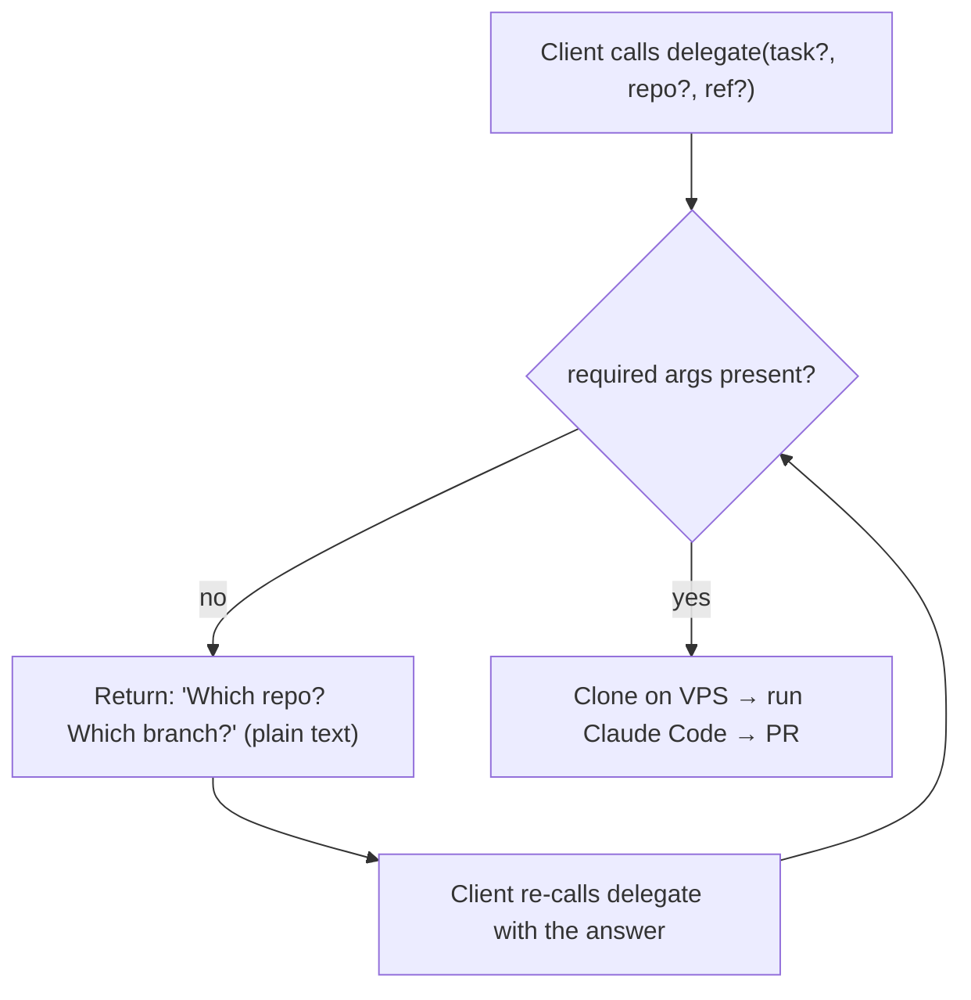

# Remote MCP controller — plan

## Vision
Delegate from **Cursor first** — both the local "delegate THIS" flow (stdio) and a remote
"delegate a git repo" flow (Cursor's remote MCP over HTTP). Because it's MCP, the same HTTP
endpoint also works from **any other MCP client** (Claude web, other IDEs, CI). Two entry points,
one shared muscle on the VPS.

```
Cursor (Mac, stdio) ─ local edits ─┐
Claude web/phone/CI ─ HTTPS+token ─┤→ same msb + warm pool (VPS) → microVMs → Claude Code → PR
```

Guiding rule: **build only what the goal needs now.** Phase 1 ships the feature. Phase 2 is a
backlog we pull from only when a real task demands it — not before.

---

# Phase 1 — lean remote trigger + ask-if-missing (BUILD NOW)

## Scope
1. Reach delegation from other MCP clients over HTTPS.
2. Remote delegations run on a **git repo/branch** (remote can't see the Mac's files).
3. **Ask-if-missing:** if a delegate call lacks a required arg, don't fail — return a question;
   you re-call with the value.

## What that needs
| File | New? | Job |
|---|---|---|
| `src/git-source.ts` | new | fresh shallow clone `owner/repo@ref` on the VPS (uses GH_TOKEN) |
| `src/http.ts` | new | Streamable HTTP transport + bearer-token guard; reuses existing handlers |
| `src/handlers.ts` | refactor | extract the current tool handlers so stdio (`index.ts`) and HTTP share them |
| `src/index.ts` | small edit | import shared handlers; stays the stdio/rsync entry (unchanged behavior) |

Reused untouched: `msb.ts`, `pool.ts`, `config.ts`, `ssh.ts`, `sync.ts`, egress, caps, warm
pool, no-attribution, `resume`, `teardown`, `status`, `pool_status`.

## Ask-if-missing — kept simple (no marker protocol)
This is the ONLY ask feature in Phase 1, and it lives entirely in the delegate tool — **not** in
the agent. No fenced markers, no mid-task pausing (that's Phase 2).



Rules:
- Required for a remote delegate: `repo` (+ `task`). `ref` optional (defaults to repo default branch).
- Missing → return a short, plain-text question listing exactly what's needed. No error, no crash.
- The client (you) re-calls `delegate` with the value. Stateless — no half-open session to track.

## delegate tool (current shape) — ASYNC
`delegate` stages the repo(s), acquires a box, then **launches the agent detached** and returns the
session id right away. It does NOT wait for the agent to finish (that used to overrun the MCP
response timeout and lose the session id). Watch progress with `status`.

| Arg | Required? | Note |
|---|---|---|
| `task` | yes | natural-language task (defines the goal — analysis/fix/PR/tests/anything) |
| `source` | no | `local` (rsync tree, stdio default) or `git` (the sandbox checks the repo out itself; remote default/only) |
| `repo` | yes* | single-repo shorthand. local: path; git: `owner/name` or https URL |
| `repos` | yes* | `[{repo,ref?,patch?}]` for a cross-repo task; each → `/workspace/<name>` in one box |
| `ref` | no | branch/tag/SHA for the single `repo`; default = repo default branch |
| `patch` | no | git only: a caller-generated `git diff origin/<ref> --binary`, applied over the fresh checkout — carries uncommitted/unpushed work when (and only when) the TASK depends on it. `source` says where the code comes from; `patch` says whether local work rides along — independent axes. |
| `allowDomains` | no | extra egress domains |
| `githubToken` | no | answer to a "need a token" ask — validated, stored by login, then used |
| `githubAccount` | no | answer to a "which account" ask — the stored login to use |

*One of `repo` or `repos` required. Local with neither falls back to `WORKSPACE_DIR`
(`${workspaceFolder}`). Missing `repo`/`task` → returns a plain-text question, not an error.

## status tool — run state (interactive)
`status(session)` returns the box state plus an in-box run marker: `run:running`,
`run:done exit=<code>`, `run:idle`, or **`run:waiting`**, followed by the last ~60 lines of
`/workspace/.agent.log`. Markers are sentinel files the detached run writes (`.agent.running` while
in flight, `.agent.done` holding the exit code when finished).

**`run:waiting`** is the interactive-development signal: the agent wrote a QUESTION to
`/workspace/.agent.question` and paused (a pending question overrides `run:done`). The calling agent
should answer it — from repo/context if it can, otherwise ask the user — and then call
`resume(session, "<answer>")`, which clears the question file and continues the same Claude session.

## resume tool (on-demand secrets) — ASYNC
Continues the in-box Claude session detached (same async model as delegate); poll `status`.

| Arg | Required? | Note |
|---|---|---|
| `session` | yes | box id from delegate |
| `message` | yes | follow-up / answer to the agent |
| `secrets` | no | `{KEY:val}` injected as env for **this step only** — ephemeral for THIS run |

Ask-then-resume: the standing system prompt tells the agent to STOP and name the exact env var it
needs (private-repo token, DB URL, API key) instead of failing/faking — and never print secret
values. You re-call `resume` with `secrets`. A **GitHub token** passed in `secrets` is additionally
**captured permanently** into the token store (keyed by the box's repo owners), so subsequent
delegations to those owners are automatic — the injection into THIS run is still ephemeral.

**Identity on resume:** `resume` only has a box id, so it reads each in-box repo's `origin`
(`boxRepoRefs`), re-resolves the access account per repo (`resolveCredsForBox`), and re-applies the
per-repo git identity/token before continuing. Without this a follow-up commit fell back to a stale
baked identity (the earlier `atom-bot` bug).

## Login-keyed, access-based GitHub token store
Reactive, multi-account GitHub auth. Store lives on the VPS at `~/.agent-sandbox/gh-tokens.json`
(chmod 600), keyed by **account login**: `{login, token, type, orgs[], verifiedRepos[]}`.

**Resolution on delegate (git source), per repo:**
1. Pre-filter stored accounts by cached access (login owns it / owner in `orgs` / repo in
   `verifiedRepos`), then **live-probe** `GET /repos/{owner}/{name}` with each to be certain.
2. **1 account** → use it (record the confirmed repo). **>1** → return a question listing logins;
   caller re-calls with `githubAccount`. **0** → return "provide a token"; caller re-calls with
   `githubToken`.
3. A provided `githubToken` is **probed** (GET /user → login, GET /user/orgs, repo access), stored by
   login, then used. Invalid token → clear question to try again.

Used both to CLONE private repos and inside the box (per-owner `~/.git-credentials` with
`credential.useHttpPath true`; first repo's token → `GH_TOKEN` for the `gh` CLI). There is **no
default account**: commit identity is set **per repo** (`git -C /workspace/<name> config user.*` =
the login of the account with access to that repo), so a repo is always authored by an account that
can push it. Resolution runs for **local too** (owner read from the working tree's `origin`).

### gh_token_add tool (optional pre-registration)
| Arg | Required? | Note |
|---|---|---|
| `token` | yes | GitHub PAT (classic or fine-grained) — identifies itself via GET /user |
| `repo` | no | owner/name to confirm + record access to |

Usually unnecessary: delegate asks for a token on demand. A token given via `resume(secrets)` is also
probed + stored.

## git-source (fresh clone, idempotent)
- Always `git clone --depth 1 --branch <ref>` into a per-session staging dir. Never reuse/pull.
- Private repos: use GH_TOKEN in the HTTPS URL. GitHub-only for now, behind one function so other
  hosts can be added later.
- Output = staging path, handed to the existing `acquireBox`/copy flow exactly like rsync staging.

## Transport + deploy
- `http.ts`: Streamable HTTP at `/mcp`, require `Authorization: Bearer <MCP_HTTP_TOKEN>`. App
  binds `127.0.0.1:8787`; Traefik terminates TLS at `agent-sandbox.<domain>`.
- systemd unit keeps it alive across reboots; `EnvironmentFile=.env`.
- **SSH-to-self is fine for now:** the on-VPS controller can keep using `VPS_SSH=<vps>` (a real
  ssh hop to itself). We do NOT build a local runner in Phase 1 — it's an optimization, deferred.

## Security (Phase 1 = adequate for a private, single-user tool)
- TLS (Traefik) + bearer token (long, random, in `.env`, rotatable).
- Existing blast-radius caps already apply: `MSB_MAX_BOXES`, per-box `-m`, idle/max-duration
  auto-teardown, egress allowlist.
- Never expose `:8787` raw. Token in `.env` only (gitignored).
- Note: the token can boot VMs + reach GH_TOKEN. Fine while it's just you. Hardening → Phase 2.

## Build order (each independently verifiable)
| # | Step | Verify | Status |
|---|---|---|---|
| 0 | test harness (tsx + node:test) | `npm test` runs | ✅ |
| 1 | `handlers.ts` — extract handlers from `index.ts`; stdio unchanged | stdio lists 5 tools | ✅ (4 tests) |
| 2 | `git-source.ts` — fresh shallow clone on VPS | pure helpers tested; clone builds argv | ✅ (8 tests) |
| 3 | delegate: `source`/`repo`/`ref` args + **ask-if-missing** | omit repo → question, not error | ✅ (9 tests) |
| 4 | `http.ts` — Streamable HTTP + bearer token | live: 401 w/o token, tools/list w/ token | ✅ (6 auth tests + live) |
| 5 | Dockerfile + compose (Dokploy) + `agent-sandbox.example.com` + `MCP_HTTP_TOKEN` | files ready; `SSH_EXTRA_OPTS` for container→host | ✅ artifacts (3 ssh tests) |
| 6 | deploy (standalone compose at `/root/agent-sandbox-deploy`); add URL to Cursor; live smoke | delegate `owner/repo` ran real analysis; resume/status/teardown verified | ✅ live 2026-08-18 |

**Test total: 52 passing.** Files: `git-source.ts`, `delegate-input.ts`, `handlers.ts`,
`deps.ts`, `http.ts`, `http-auth.ts`, `agent-prompt.ts`, `secret-env.ts`, `staging-paths`,
ssh extra-opts; `index.ts`/`http.ts` share handlers. Post-1: multi-repo + on-demand secrets.

> Deploy note: agent-sandbox runs as a **standalone `docker compose`** stack from a git clone at
> `/root/agent-sandbox-deploy` (NOT a Dokploy app). Redeploy = `git reset --hard origin/main &&
> docker compose up -d --build`. Traefik on `dokploy-network` still routes the domain.

## Deploy (Dokploy) — how the container reaches msb
The container does NOT run msb (needs KVM/microVMs on the host). It **SSHes to the VPS host** to
drive msb — same code, just `VPS_SSH=root@<host>` + `SSH_EXTRA_OPTS=-i /root/.ssh/id_ed25519 -o
StrictHostKeyChecking=accept-new`, with the key mounted read-only. Traefik terminates TLS at
`agent-sandbox.example.com` → container `:8787` (binds `0.0.0.0` in-container only, never
published to host/public). Pointer app added under AKVps `deployments/apps/agent-sandbox/`.

## Phase 1 explicitly does NOT include
Secret vault (persisted) · agent-emitted fenced need-input markers · session sweep ·
IP allowlist / split hostnames / Cloudflare Access · local runner. All → Phase 2.

## Shipped after Phase 1 (post-1)
- **Multi-repo delegation** (`repos:[...]`, one box, `/workspace/<name>` each) + `WORKSPACE_DIR`
  local fallback + goal-neutral prompt (task defines the outcome, not the infra).
- **On-demand secrets (ask-then-resume, ephemeral)** — `resume(secrets)` injects `-e KEY=VALUE`
  for that step only; prompt tells the agent to STOP + name the env var it needs. This is the
  lightweight half of 2a below (no persisted vault, no fenced marker protocol yet).

---

# Phase 2 — everything else (build ONLY when a real task needs it)

Pull items individually; none are prerequisites for Phase 1.

## 2a. Secret vault (by name) + fenced ask — PARTIALLY DONE
Mid-task secret injection is DONE (see "Shipped after Phase 1"): `resume(session, msg, secrets?)`
threads ephemeral `-e KEY=VALUE` per-turn, and the system prompt tells the agent to ask by env-var
name. What remains for a fuller version:
- **Persisted vault:** age/sops encrypted file on VPS, key in `.env`. Tools: `secret_register`,
  `secret_list` (names only) — so secrets survive across delegations / are reused by name.
- **Fenced `need-input` block** (last-one-wins parse) so a blocked turn emits a structured ask
  (vs. free-text in the output today). Would make the ask machine-parseable for auto-prompting.

## 2b. Local runner (`VPS_SSH=local`)
Optimization: when the controller runs ON the VPS, run `msb`/git via `child_process` and skip
ssh+rsync (today `VPS_SSH=localhost` is still a real ssh hop). ~15 lines across
`exec.ts`/`msb.ts`/`sync.ts`. Do it if the self-ssh hop proves annoying or slow.

## 2c. Session sweep
Evict HTTP sessions idle > 30m and tear down their box. Derive "last active" from `msb
status`/`metrics` (no new store). Only needed if orphaned sessions actually pile up — box
idle/max-duration timers already stop runaway VMs.

## 2d. Token hardening (when exposed beyond just you)
The public token boots VMs + reaches GH_TOKEN/vault, so harden the day it's used more widely:
- **Split hostname:** `mcp.<domain>` IP-allowlisted (your Mac/phone/CI) + `mcp-web.<domain>`
  token-only + tight rate-limit + audit (for Claude web, whose IPs aren't yours).
- **Upgrade path:** Cloudflare Access (login-as-you) replaces the token/IP dance entirely.
- Rate limit: 60 req/min/IP + max 5 concurrent sessions (aligns to `MSB_MAX_BOXES`).

### The web-vs-IP-allowlist tension (why 2d is deferred)
You can't have strict IP-lock AND Claude web on the same door — web calls from Anthropic's IPs,
not yours. Resolution when needed: two doors (split hostname above). Not worth building until the
web path is actually in use.

---

## Scope guard (applies to both phases)
- No web UI — clients are MCP clients.
- No multi-user/RBAC — single owner, one token.
- Mac controller keeps rsync (no git requirement for local "delegate THIS").
