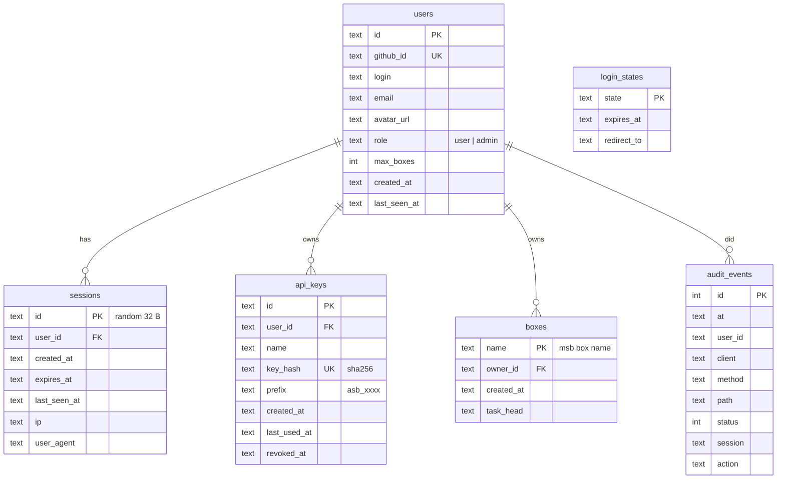

# Agent Sandbox as a multi-user SaaS — design

Status: **Phases 1 and 2 implemented behind `AUTH_MODE=saas`** — users, sessions, API keys, box
ownership, per-user quota, **and per-user integrations** (GitHub accounts and MCP servers are
encrypted rows per owner; background jobs run *as the box owner*). Sign-in works with an admin-issued
access token alone; GitHub OAuth is optional. Default `AUTH_MODE=token` keeps the single-operator
behaviour byte-for-byte. Self-hosters: `docs/self-hosting.md`.
See `docs/architecture.md` for today's map; this document is the target and the path.

## 1. Principles

1. **Identity before everything.** Every request resolves to a *principal* before any handler runs:
   `operator` (the deployment's own token — break-glass and automation), or `user` (a signed-in
   person, via browser session or API key). No principal, no route.
2. **Ownership is resolved centrally, once.** Routes never look a box up by name. They call
   `ownedBox(principal, name)`; it returns the box only if the principal may act on it. Listing is
   filtered the same way. One function to audit, one place to get right.
3. **Tenant data never shares a file, a directory or a process cache key.** Per-user rows in the
   database; per-user directories on the sandbox host; per-user cache keys in memory.
4. **The sandbox host is not a trust boundary between users — the controller is.** `msb` runs as
   root; the controller is the only SSH principal and only ever passes *validated box names* and
   *files it wrote itself* to the host. Users never influence a shell word.
5. **Secrets are injected, not stored in the box image**, and only the owner's secrets go into the
   owner's box.
6. **Fail closed, log every mutation, keep the audit attributable** to a user id.

## 2. Identity

```mermaid
sequenceDiagram
  autonumber
  participant B as Browser
  participant C as Controller
  participant GH as GitHub OAuth
  B->>C: GET /auth/github
  C->>C: state = random(32) → login_states(expires 10 min)
  C-->>B: 302 github.com/login/oauth/authorize?client_id&state&scope=read:user user:email
  B->>GH: consent
  GH-->>B: 302 /auth/github/callback?code&state
  B->>C: GET /auth/github/callback
  C->>C: state must exist & be unexpired (single use)
  C->>GH: POST /login/oauth/access_token (server-side, client_secret)
  GH-->>C: access_token
  C->>GH: GET /user, /user/emails
  C->>C: upsert users(github_id) · sessions(id=random 32B, expires 30 d)
  C-->>B: Set-Cookie asb_session=<id>; HttpOnly; Secure; SameSite=Lax; Path=/ → 302 /dashboard/
```

- **Sessions** are opaque random ids stored server-side (revocable, listable); the cookie carries no
  claims. Sliding expiry: touched at most once per hour, hard cap 30 days.
- **CSRF**: cookie-authenticated *mutating* requests must carry `X-Requested-With: agent-sandbox`
  and an `Origin`/`Sec-Fetch-Site` that is same-origin. A cross-site form or fetch cannot add the
  custom header without a CORS preflight, which we never grant.
- **API keys** (for `/mcp`, CI): `asb_` + 32 random bytes base64url, shown once, stored as
  SHA-256; row carries `user_id`, `name`, `last_used_at`, `revoked_at`. Sent as `Authorization:
  Bearer asb_…`. Same routes, same ownership rules; no cookie, no CSRF needed.
- **Operator token** (`MCP_HTTP_TOKEN` / `DASHBOARD_TOKEN`) remains valid in `saas` mode as the
  `operator` principal: sees everything, can act on everything, and is what the deployment's own
  automation (pool maintainer, CI) uses. Rotate it like a root password.
- The browser **no longer holds any secret in JavaScript** in `saas` mode: no `localStorage` token,
  the cookie is `HttpOnly`. XSS can act *as* the user while the page is open, but cannot exfiltrate a
  reusable credential — and CSP already blocks script injection and off-origin `connect-src`.

## 3. Data model (SQLite now, Postgres when N > 1 controller)



The **box** is the pivot. `boxes.owner_id` is written the moment a delegate claims or boots one.
Warm pool boxes (`pool-free`) have no owner and are infrastructure: invisible to users, visible to
the operator. A box with no row (pre-migration) belongs to nobody but the operator.

## 4. Isolation, layer by layer

| Layer | Today (single operator) | Multi-user |
|---|---|---|
| **Request** | bearer = root | principal resolved first; `ownedBox()` on every session-taking route; fleet filtered; `pool-free` hidden from users |
| **Controller memory** | caches keyed by box name | unchanged for box-keyed caches (names are unguessable and ownership is checked before serving); per-user caches (repos, integrations) keyed by `user_id` |
| **Sandbox host files** | `~/.agent-sandbox/{claims,keep,titles,runs}/<box>` | unchanged (box-keyed, box names validated); per-user integration files move into the DB (Phase 2) |
| **GitHub credentials** | one `gh-tokens.json` | Phase 2: `user_integrations(user_id, kind, login, secret_enc)`; only the owner's tokens are resolved for clone/PR; encrypted with a controller key (`SECRETS_KEY`, 32 B) using AES-256-GCM |
| **MCP servers for the agent** | one `mcp.json` copied into every box | Phase 2: per-user `mcp_servers`; the bootstrap writes *the owner's* set into the box |
| **Staging dir on host** | `/root/agent-sandbox-staging/<box>` | unchanged — box-scoped, validated name; wiped on teardown |
| **microVM** | root inside; egress allowlist global; 1 GiB | unchanged per box; per-plan sizing/egress later; **no two users ever share a VM** — a box is claimed by exactly one owner for its lifetime |
| **Model access** | one `ANTHROPIC_*` for all boxes (via ccproxy) | Phase 3: per-user key or metered shared key; usage attributed to `user_id` from the run record |
| **Quota** | `MSB_MAX_BOXES` global | `users.max_boxes` (default `USER_MAX_BOXES`, 2) checked in delegate *before* claiming; global cap still applies |
| **Audit** | client address | `user_id` on every event; queryable per user |

## 5. Threat model (what changes)

| Threat | Control |
|---|---|
| User A acts on user B's box (IDOR) | `ownedBox()` is the only lookup; 404 for non-owned (no existence oracle); fleet is filtered; SSE/watch/artifact/file/tree all go through it |
| Stolen session cookie | HttpOnly (not readable by JS); revocable server-side; 30-day cap; sign-out deletes the row |
| CSRF against cookie auth | custom header + same-origin `Sec-Fetch-Site`/`Origin` requirement on mutations |
| Leaked API key | hashed at rest (a DB dump reveals nothing); revocable; per-key `last_used_at` for detection; prefix shown in UI to identify |
| OAuth code injection / login CSRF | server-generated single-use `state` with 10-minute expiry; callback rejects unknown state |
| Brute force on operator token / API keys | per-client throttle (429) — unchanged |
| User-controlled strings reaching the host shell | unchanged: only validated box names and `owner/name` repos; everything else via stdin or files the controller writes |
| Tenant secrets in another tenant's VM | only the owner's integrations are injected (Phase 2); pool boxes carry no secrets until claimed |
| Noisy neighbour / cost abuse | per-user `max_boxes`, global cap, run duration cap; per-user rate limit (Phase 2) |

## 6. Phases

1. **Identity + ownership (this change).** SQLite, users/sessions/api_keys/boxes, GitHub OAuth,
   cookie sessions with CSRF, API keys UI, `ownedBox()` everywhere, fleet filter, per-user quota,
   attributable audit. Flag: `AUTH_MODE=saas`.
2. **Per-user integrations — done.** GitHub PATs and MCP servers live in `user_blobs(owner_id, kind)`
   encrypted with AES-256-GCM (`SECRETS_KEY` or `DATA_DIR/secrets.key`). The store modules keep their
   signatures and read *the calling principal's* row (`src/user-store.ts`, via the same
   AsyncLocalStorage principal); repo-list and PR caches are per owner; inbox delivery, the credential
   broker and admin-triggered resumes run `withOwner(box)`, so a machine always gets its owner's
   credentials and MCP servers. The redactor sees every owner's secrets. Still to do: per-user rate limits.
3. **Billing + plans.** Plans define `max_boxes`, run minutes, memory; usage from run records;
   Stripe customer per user; model usage attribution.
4. **Scale-out.** Postgres; N controllers behind Traefik (sessions already server-side);
   several sandbox hosts with a host column on `boxes`; per-tenant egress policies.

## 7. Configuration (Phase 1)

| Variable | Meaning |
|---|---|
| `AUTH_MODE` | `token` (default; unchanged behaviour) or `saas` |
| `DATA_DIR` | where `asb.sqlite` lives (compose mounts `./data`) |
| `PUBLIC_URL` | e.g. `https://agent-sandbox.example.com` — OAuth callback base and cookie `Secure` |
| `GITHUB_OAUTH_CLIENT_ID` / `GITHUB_OAUTH_CLIENT_SECRET` | the GitHub OAuth App (callback `PUBLIC_URL/auth/github/callback`) |
| `USER_MAX_BOXES` | default per-user concurrent box quota (2) |
| `ADMIN_GITHUB_LOGINS` | comma-separated logins that get `role=admin` on first login (see all boxes, like the operator) |
